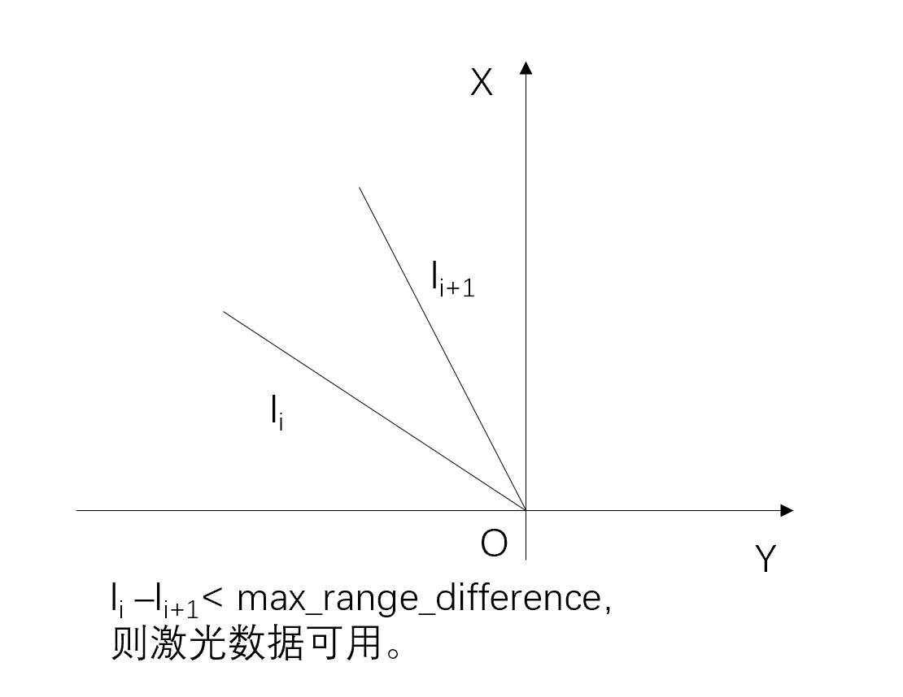
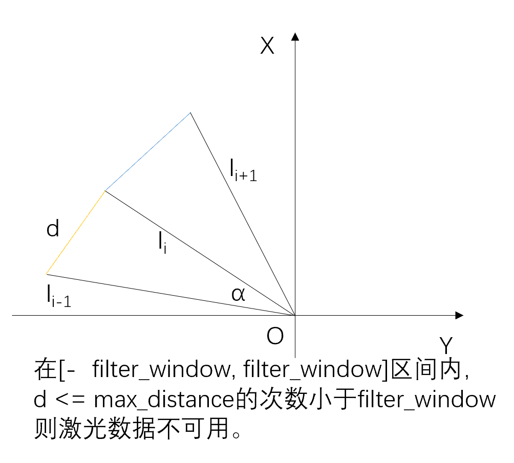

之前一直在用indigo版本的 `laser_filters` ，最近更新了melodic版本的，发现多了 `LaserScanSpeckleFilter` 这个插件，试用之后发现效果还不错，分享给大家。
  
## 参数
- filter_type (int)
滤波算法选择
  - 0：基于距离的滤波（连续点的距离）
  - 1：基于半径离群点搜索的欧几里得距离滤除
- max_range (double)
只考虑比这个范围小的数据
- max_range_difference (double)
  - 连续点的最大距离差（当filter_type为0）
  - 点之间的最大欧几里得距离差（当filter_type为1）
- filter_window (double)
滤波窗口
  
## 代码阅读
阅读 `speckle_filter.h` 和 `speckle_filter.cpp` ，发现主要函数为 `update()` 和 `checkWindowValid()` ，滤波时会执行 `update()` 函数，而 `update()` 中使用 `checkWindowValid()` 判断激光点是否需要滤除。根据 `filter_type` 选择的不同，会调用不同的 `checkWindowValid()` 函数。下面继续查看 `checkWindowValid()` 函数。  
- filter_type 0：基于距离的滤波（连续点的距离）  
    ```cpp
    class DistanceWindowValidator : public WindowValidator
    {
        virtual bool checkWindowValid(const sensor_msgs::LaserScan& scan, size_t idx, size_t window, double max_range_difference)
        {
            const float& range = scan.ranges[idx];
            if (range != range) {
                return false;
            }

            for (size_t neighbor_idx_nr = 1; neighbor_idx_nr < window; ++neighbor_idx_nr)
            {
                size_t neighbor_idx = idx + neighbor_idx_nr;
                if (neighbor_idx < scan.ranges.size())  // Out of bound check
                {
                    const float& neighbor_range = scan.ranges[neighbor_idx];
                    if (neighbor_range != neighbor_range || fabs(neighbor_range - range) > max_range_difference)
                    {
                    return false;
                    }
                }
            }
            return true;
        }
    };
    ```
    这里原理比较简单，对于意外来源的随机噪声也是够用的，原理如下图所示：
    
  
- filter_type 1：基于半径离群点搜索的欧几里得距离滤波  
    ```cpp
    class RadiusOutlierWindowValidator : public WindowValidator
    {
    virtual bool checkWindowValid(const sensor_msgs::LaserScan& scan, size_t idx, size_t window, double max_distance)
    {
        int num_neighbors = 0;
        const float& r1 = scan.ranges[idx];
        float r2 = 0.;

        // Look around the current point until either the window is exceeded
        // or the number of neighbors was found.
        for (int y = -(int)window; y < (int)window + 1 && num_neighbors < (int)window; y++)
        {
            int j = idx + y;
            r2 = scan.ranges[j];

            if (j < 0 || j >= static_cast<int>(scan.ranges.size()) || idx == j || std::isnan(r2))
            {  // Out of scan bounds or itself or infinity
                continue;
            }

            // Explanation:
            //
            // Distance between two points:
            // d² = (x2 - x1)² + (y2 - y1)²
            //
            // Substitute x with r * cos(phi) and y with r * sin(phi):
            // d² = (r2 * cos(phi2) - r1 * cos(phi1))² + (r2 * sin(phi2) - r1 * sin(phi1))²
            //
            // Apply binomial theorem:
            // d² = ((r2² * cos(phi2)² + r1² * cos(phi1)² - 2 * r1 * r2 * cos(phi1) * cos(phi2)) +
            //      ((r2² * sin(phi2)² + r1² * sin(phi1)² - 2 * r1 * r2 * sin(phi1) * sin(phi2))
            //
            // Merge sums:
            // d² = r2² * (cos(phi2)² + sin(phi2)²) + r1² * (cos(phi1)² + sin(phi1)² -
            //      2 * r1 * r2 * (cos(phi1) * cos(phi2) + sin(phi1) * sin(phi2))
            //
            // Apply cos² + sin² = 1:
            // d² = r2² + r1² - 2 * r1 * r2 * (cos(phi1) * cos(phi2) + sin(phi1) * sin(phi2))
            //
            // Note the following:
            // cos(phi1) * cos(phi2) = 1/2 * (cos(phi1 - phi2) + cos(phi1 + phi2))
            // sin(phi1) * sin(phi2) = 1/2 * (cos(phi1 - phi2) - cos(phi1 + phi2))
            //
            // cos(phi1) * cos(phi2) + sin(phi1) * sin(phi2) = cos(phi1 - phi2)
            //
            // Finally, phi1 - phi2 is our included_angle.

            const float d = sqrt(
                    pow(r1,2) + pow(r2,2) -
                    (2 * r1 * r2 * cosf(y * scan.angle_increment)));


            if (d <= max_distance)
            {
                num_neighbors++;
            }
        }

        // consider the window to be the number of neighbors we need
        if (num_neighbors < window)
        {
            return false;
        }
        else
        {
            return true;
        }
    }
    };
    ```
    没看代码之前，我以为这里是用PCL库的 [RadiusOutlier removal](https://pcl.readthedocs.io/projects/tutorials/en/master/remove_outliers.html#remove-outliers) 实现的，阅读代码后发现这里实现的是比较巧妙的，如下图所示：
      
    这里还有个问题是如何求 `d` ，代码中注释部分给出了解析法，其实可以用余弦定理或者使用几何法自行证明，已知两边长度及夹角，求第三边长度。（ $c^2=a^2+b^2-2ab\cos{C}$ ）
  
---
## 参考
[官方wiki](http://wiki.ros.org/laser_filters#LaserScanSpeckleFilter)  
[插件源码](https://github.com/ros-perception/laser_filters/blob/ros2/include/laser_filters/speckle_filter.h#L225)  
<!-- [ros_comm](https://github.com/ros/ros_comm)  
[一文搞懂XML、Json、Protobuf序列化协议](https://blog.csdn.net/Jiangtagong/article/details/119656782)  
[探索ROS中的XML](https://www.dazhuanlan.com/heraclitus/topics/1235795) -->