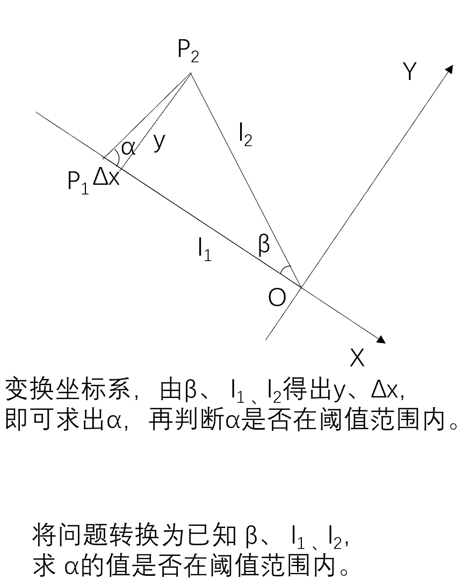
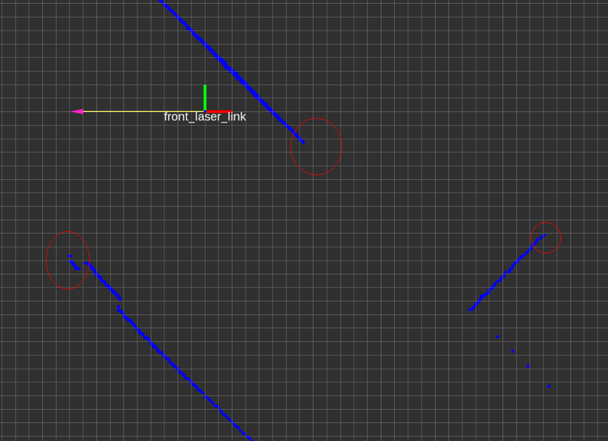

## 什么是拖尾现象
理想的激光脉冲打在目标上是一个点，但是实际上激光出射都存在一定的发散角，打在物体上时光斑是一个面。因此，当存在前后两个物体，且激光正好打在前面一个物体的边缘时，就有可能出现一部分激光能量打在了后面的物体上，这时的回返光就是两个光斑反射光的叠加。这时雷达会判断测量目标在这两个面之间，造成拖尾现象。  

## 如何解决该问题
发生拖尾现象时，激光束呈射线状，我们可以根据这一现象来去除问题数据。据此得到下图中的数学问题：

转换坐标系，可以比较容易得出目标角，从而判断目标角是否在阈值范围内。


## 代码实现
本着不重复造轮子的原则，我们可以用laser_filters包中的ScanShadowsFilter插件来移除有拖尾（veiling effect）现象的数据。如上图所示，假设激光的原点是$O$，对于任何两个点$P_1$和$P_2$，则形成角$\angle{OP_1P_2}$，如果该角度小于最小阈值角度（min_angle）或大于最大阈值角度（max_angle），我们将该点及其附近符合条件的点移除。  
参数：  
min_angle (double)  
最小阈值角度（角度制）  
max_angle (double)  
最大阈值角度（角度制）  
window (int)  
需要计算的目标角的窗口大小  
neighbors (int)  
需要删除拖尾数据附近数据（且该数据大于拖尾数据）的个数  

## 测试结果
```yaml
scan_filter_chain:
- name: shadows
  type: laser_filters/ScanShadowsFilter
  params:
    min_angle: 5
    max_angle: 175
    neighbors: 3
    window: 2
    remove_shadow_start_point: false
```
过滤前，可以看到存在拖尾现象的数据有三处，如下图所示：


过滤后，如下图所示，存在拖尾现象的数据已被滤除，但是正常数据也被移除了一部分，可以通过调节neighbors大小来减少影响。


## 参考
[官方wiki](http://wiki.ros.org/laser_filters#ScanShadowsFilter)