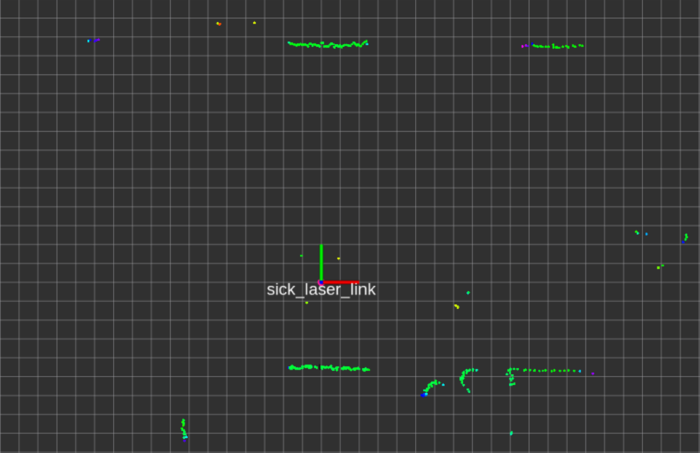
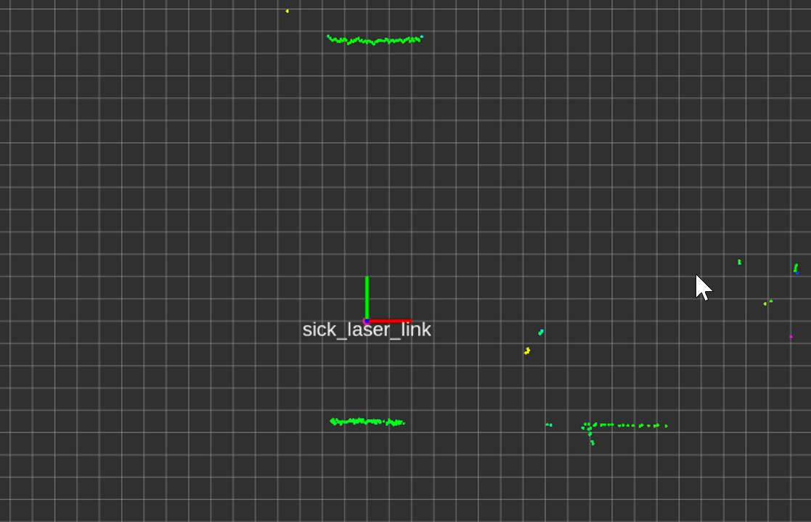
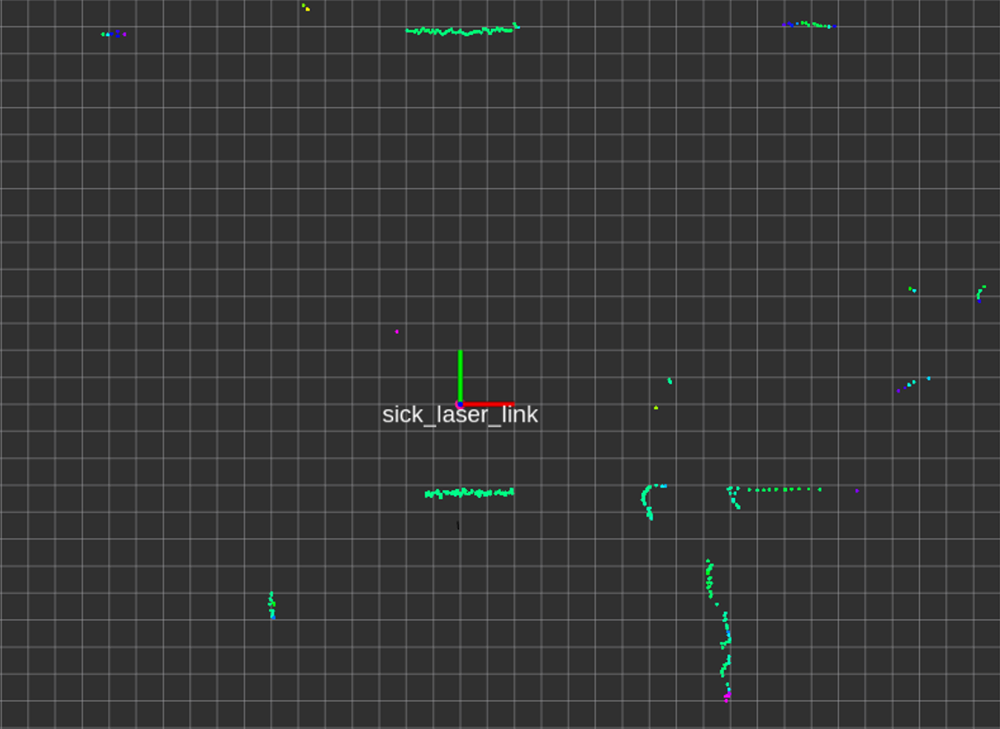

我们在实际应用中，难免会碰到车体遮挡激光雷达的情况，最常见的情况是使用四个柱子作为支撑遮挡了激光雷达，这时可以使用 `laser_filters` 处理激光雷达数据。有两种处理方法，最简单的方法为屏蔽对应角度；另一种为屏蔽车体内部的激光数据。  
  
## 方法一：屏蔽角度
这里用 `LaserScanAngularBoundsFilterInPlace` 插件来实现，使用这种方法需要有底盘的详细数据，计算出柱子遮挡的角度，由于每次只能屏蔽一个角度，需要连续使用四次。如果觉得效率不够高，可以自己实现一个滤波插件。使用的参数如下：  
```yaml
scan_filter_chain:
- name: angle1
  type: laser_filters/LaserScanAngularBoundsFilterInPlace
  params:
    lower_angle: -3.14159
    upper_angle: -1.91986
- name: angle2
  type: laser_filters/LaserScanAngularBoundsFilterInPlace
  params:
    lower_angle: -1.221727823
    upper_angle: -0.52359612201
- name: angle3
  type: laser_filters/LaserScanAngularBoundsFilterInPlace
  params:
    lower_angle: 0.61086789
    upper_angle: 1.1519199599
- name: angle4
  type: laser_filters/LaserScanAngularBoundsFilterInPlace
  params:
    lower_angle: 1.91986483
    upper_angle: 3.14
```
滤波前可以看到四个柱子的位置存在遮挡产生的激光点，如下图所示：（不是每帧激光都会在四个柱子附近出现激光点）  

滤波后四个柱子附近的激光点已经全部被滤除，由于存在安装误差，这里参数设置的有些保守，会多滤除一些数据。  

  
## 方法二：屏蔽车体内部激光数据
使用这种方法可以不用获得底盘的详细数据，只需卷尺测量即可。这里有很多插件可以选择， `LaserScanBoxFilter` （矩形）、 `LaserScanFootprintFilter` （内切圆）、 `LaserScanPolygonFilter` （多边形）等等。这里使用 `LaserScanFootprintFilter` ，配置参数如下：  
```yaml
scan_filter_chain:
- name: footprint_filter
  type: laser_filters/LaserScanFootprintFilter
  params:
    inscribed_radius: 0.225
```
滤波后四个柱子附近的激光点都被滤除，但是偶尔会有随机噪点产生，如下图所示：  

这里的噪点可以使用 `LaserScanSpeckleFilter` 过滤，可以查看我之前的[文章](../使用LaserScanSpeckleFilter过滤激光雷达噪点/使用LaserScanSpeckleFilter过滤激光雷达噪点.md)，更新后的配置参数如下：  
```yaml
scan_filter_chain:
- name: footprint_filter
  type: laser_filters/LaserScanFootprintFilter
  params:
    inscribed_radius: 0.225
- name: speckle_filter
  type: laser_filters/LaserScanSpeckleFilter
  params:
    filter_type: 0
    max_range: 2.0
    max_range_difference: 0.1
    filter_window: 2
```
随机噪声滤除后，激光数据也算是可用的了。  
PS：这里的随机噪声其实是激光雷达的拖尾效应产生的（之前写过拖尾效应的[介绍](../使用ScanShadowsFilter过滤激光雷达拖尾/使用ScanShadowsFilter过滤激光雷达拖尾.md)），但是激光雷达固件中开启了噪声滤除，会过滤一些数据，所以这里的激光点会看起来像随机噪声，也可以通过增强激光雷达固件中的噪声滤除来去除这种噪点。  
  
---
## 参考
[官方wiki](http://wiki.ros.org/laser_filters)  
[插件源码](https://github.com/ros-perception/laser_filters/)  
<!-- [ros_comm](https://github.com/ros/ros_comm)  
[一文搞懂XML、Json、Protobuf序列化协议](https://blog.csdn.net/Jiangtagong/article/details/119656782)  
[探索ROS中的XML](https://www.dazhuanlan.com/heraclitus/topics/1235795) -->